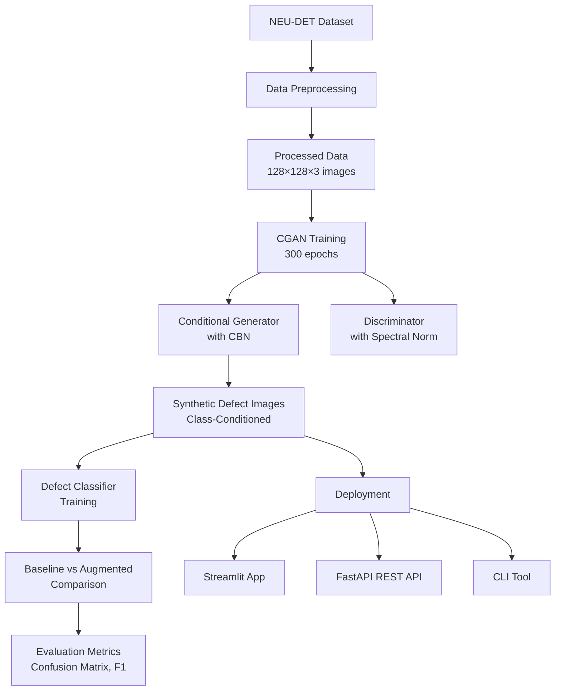

# 🏭 Project 5: Synthetic Surface Defect Image Generation using Conditional GAN (CGAN)

A complete end-to-end system that uses **Conditional Generative Adversarial Networks (CGANs)** to generate realistic **steel surface defect images** and mitigate **data scarcity and class imbalance** in industrial defect classification.

This repository contains everything required to **preprocess data, train a CGAN, generate synthetic images, augment classifiers, evaluate performance, and deploy the system via UI & API**.

---

## 📌 Why this project?

Automated surface defect detection is critical in **modern manufacturing and quality control**. However, real-world industrial datasets often suffer from:

- **Severe class imbalance** (rare defects have very few samples)
- **Limited labeled data** (expensive manual inspection and annotation)
- **High cost of expert annotation** (skilled technicians required)

Traditional augmentation techniques (flip, rotate, color jitter) **cannot capture complex defect patterns** such as surface texture, crack patterns, and material-specific anomalies.

**The core problem addressed in this project is:**  
**How can realistic synthetic steel surface defect images be generated and effectively utilized to mitigate data scarcity, balance classes, and improve defect classification accuracy?**

---

## 🧭 What does this project do?

- Trains a **Conditional GAN (CGAN)** on the NEU-DET steel surface defect dataset
- Generates **high-quality synthetic defect images** for 6 defect classes with explicit class control
- Augments real training data with synthetic samples to mitigate class imbalance
- Trains and compares:
  - a **Baseline classifier** trained exclusively on real images
  - an **Augmented classifier** trained on real + synthetic images
- Deploys the trained generator through:
  - an interactive **Streamlit web application**
  - a **FastAPI-based REST service** for programmatic access
  - a **CLI tool** for batch generation and experimentation

---

## 🧠 System Overview

```text
NEU-DET Dataset (Steel Surface Defects)
          ↓
Data Loading & Preprocessing
          ↓
Conditional GAN (CGAN) Training
          ↓
Synthetic Defect Images (Class-Conditioned)
          ↓
Classifier Training
          ↓
Evaluation & Performance Comparison
          ↓
Deployment (Streamlit, FastAPI, CLI)
```

---

## 📁 Repository Structure

```text
project5/
├── .gitignore                        # Git ignore rules
├── README.md                         # Project documentation
├── requirements.txt                  # Python dependencies
├── checkpoints/                      # Trained model weights
│   ├── G_0.pth, G_50.pth, ..., G_300.pth   # Generator checkpoints (50-epoch intervals)
│   └── D_0.pth, D_50.pth, ..., D_300.pth   # Discriminator checkpoints
├── configs/                          # Configuration files
│   └── config.json                   # Model hyperparameters & class mappings
├── data/                             # Dataset management
│   ├── __init__.py
│   ├── processed/                    # Preprocessed data (ready for training)
│   │   ├── images.npy                # Normalized images (N×128×128×3)
│   │   ├── labels.npy                # Integer class labels
│   │   └── class_map.json            # Class index to name mapping
│   └── raw/
│       └── NEU-DET/                  # Original NEU-DET dataset
│           ├── train/
│           │   ├── annotations/      # XML bounding box annotations
│           │   └── images/           # Grayscale surface images
│           └── validation/           # Validation split
├── figures/                          # Generated visualizations
├── notebook/                         # Jupyter notebooks (exploration)
├── registry/                         # Versioning & monitoring
│   ├── config.json                   # Active configuration snapshot
│   ├── metrics.json                  # Performance metrics
│   ├── usage_log.json                # API/CLI/App usage logs
│   └── version_registry.json         # Model version history
├── samples/                          # Generated sample images
└── src/                              # Core source code
    ├── __init__.py
    ├── generator_cgan_surface.py     # CGAN Generator (with CBN layers)
    ├── discriminator_cgan_surface.py # Discriminator (spectral normalization)
    ├── data_loader_surface.py        # PyTorch Dataset class
    ├── train_cgan_surface.py         # Main CGAN training loop
    ├── defect_classifier_train.py    # CNN classifier for defect classes
    ├── defect_classifier_eval.py     # Evaluation & confusion matrix
    ├── inference_surface_cgan.py     # Batch inference script
    ├── app_surface_cgan.py           # Streamlit web UI
    ├── api_surface_cgan.py           # FastAPI REST endpoints
    ├── config.py                     # Configuration loader
    ├── preprocess_surface_images.py  # Data preprocessing pipeline
    ├── monitor_surface_cgan.py       # Usage monitoring script
    ├── eval_surface_stats.py         # Statistical evaluation
    ├── inference/                    # CLI tools
    │   ├── __init__.py
    │   └── cli.py                    # Command-line interface for batch generation
    └── monitor/                      # Monitoring utilities
        ├── __init__.py
        └── log_usage.py              # Usage logging functions
```

> **NOTE:** Large datasets, checkpoints, logs, and generated images are excluded via `.gitignore`.

---

## 🏗️ Architecture Flow



---

## 🧩 Modules & Design

### I. 📦 Data Pipeline & Preprocessing

**Dataset Source:**

- **[NEU-DET Database](http://faculty.neu.edu.cn/songkechen/NEU_surface_defect_database.html)** - Northeastern University
- **Surface Analysis**: Steel surface defect detection dataset
- **6 Defect Classes:**
  1. **Crazing** - Fine cracks on surface
  2. **Inclusion** - Foreign material embedded in steel
  3. **Patches** - Surface patches or marks
  4. **Pitted Surface** - Pitting corrosion patterns
  5. **Rolled-in Scale** - Surface scale defects
  6. **Scratches** - Linear surface scratches
- **Image Format:** Grayscale (initially), converted to RGB for GAN training
- **Original Resolution:** Variable, resized to **128×128** for training
- **Total Samples:** ~1,800+ annotated defect images

**Data Preprocessing Steps:**

To prepare the raw NEU-DET data, run:
```bash
python src/preprocess_surface_images.py
```

**Preprocessing includes:**
1. Load grayscale images from XML annotations
2. Convert grayscale to RGB (replicate channels)
3. Normalize pixel values to [−1, 1]
4. Resize images to 128×128×3
5. Save as NumPy arrays for efficient loading:
   - `data/processed/images.npy` - All processed images
   - `data/processed/labels.npy` - Integer class indices
   - `data/processed/class_map.json` - Class name mapping

**Final Dataset Structure:**

```text
data/processed/
├── images.npy          # Shape: (N, 128, 128, 3)
├── labels.npy          # Shape: (N,) - integer class labels
└── class_map.json      # {"0": "crazing", "1": "inclusion", ...}
```

**Class Distribution:**

The NEU-DET dataset exhibits natural class imbalance:
- To address this during training, a **WeightedRandomSampler** is used
- Weights are inversely proportional to class frequencies
- Ensures balanced representation during each training epoch

---

### II. 🧩 Model Architecture

This project uses a **Conditional GAN (CGAN)** architecture specifically tailored for **128×128 RGB steel surface defect images**. The design incorporates advanced techniques for stable training and explicit class control.

#### Generator (Conditional)

Transforms a latent noise vector **and class label** into a realistic defect image.

**Input:**
- Latent vector: $z \sim N(0, I)$ (dimension = 128)
- Class label: $y$ ∈ {0, 1, 2, 3, 4, 5} (6 defect classes)

**Architecture Overview:**
- **Class Embedding:** Project class label to 32D vector
- **Concatenation:** Combine latent vector (128D) + class embedding (32D)
- **Fully Connected Layer:** [z, e(y)] → 512 × 4 × 4 feature map
- **Progressive Upsampling:** 5 ConvTranspose2D blocks with **Conditional Batch Normalization (CBN)**
- **CBN Mechanism:** Modulates batch norm using class-specific γ and β parameters
- **Final Activation:** Tanh normalization to pixel range [−1, 1]

**Architecture Diagram:**

```text
[z (128D) + y_emb (32D) = 160D]
 └─ Linear (160 → 512×4×4)
     └─ Reshape to (512, 4, 4)
         └─ ConvTranspose2D (512 → 256, k=4, s=2, p=1)
             └─ CBN (condition on y) + ReLU → (256, 8, 8)
                 └─ ConvTranspose2D (256 → 128, k=4, s=2, p=1)
                     └─ CBN (condition on y) + ReLU → (128, 16, 16)
                         └─ ConvTranspose2D (128 → 64, k=4, s=2, p=1)
                             └─ CBN (condition on y) + ReLU → (64, 32, 32)
                                 └─ ConvTranspose2D (64 → 32, k=4, s=2, p=1)
                                     └─ CBN (condition on y) + ReLU → (32, 64, 64)
                                         └─ ConvTranspose2D (32 → 3, k=4, s=2, p=1)
                                             └─ Tanh → (3, 128, 128)
```

**Output:**
- **Image:** 128 × 128 × 3 RGB tensor
- **Pixel Range:** [−1, 1]
- **Conditioning:** Explicit class control via CBN

**Conditional Batch Normalization (CBN):**

Standard batch norm is modulated per class:
$$\text{CBN}(x, y) = \gamma_y \odot \text{BN}(x) + \beta_y$$

Where:
- $\gamma_y, \beta_y$ are learnable affine parameters **per class**
- Enables fine-grained control over defect characteristics

#### Discriminator (with Spectral Normalization)

Simultaneously performs **adversarial classification** and **class prediction**.

**Input:**
- 128 × 128 × 3 RGB image

**Architecture Overview:**
- **Stride-based Downsampling:** 5 Conv2D blocks
- **Spectral Normalization:** Applied to all convolution layers for training stability
- **Activation:** LeakyReLU (slope=0.2)
- **Feature Extraction:** Progressive downsampling from (128, 128) to (4, 4)
- **Dual Outputs:**
  - **Adversarial head:** Global average pooled → Linear → Scalar (real/fake score)
  - **Classification head:** Global average pooled → Linear → 6-class logits

**Architecture Diagram:**

```text
Input Image (3, 128, 128)
 └─ SpectralNorm(Conv2D (3 → 64, k=4, s=2, p=1)) + LeakyReLU(0.2)
     └─ (64, 64, 64)
         └─ SpectralNorm(Conv2D (64 → 128, k=4, s=2, p=1)) + LeakyReLU(0.2)
             └─ (128, 32, 32)
                 └─ SpectralNorm(Conv2D (128 → 256, k=4, s=2, p=1)) + LeakyReLU(0.2)
                     └─ (256, 16, 16)
                         └─ SpectralNorm(Conv2D (256 → 512, k=4, s=2, p=1)) + LeakyReLU(0.2)
                             └─ (512, 8, 8)
                                 └─ SpectralNorm(Conv2D (512 → 512, k=4, s=2, p=1)) + LeakyReLU(0.2)
                                     └─ (512, 4, 4)
                                         └─ Flatten → (8192,)
                                             ├─ Adversarial Head:
                                             │   └─ SpectralNorm(Linear (8192 → 1)) → P(real)
                                             │
                                             └─ Classification Head:
                                                 └─ SpectralNorm(Linear (8192 → 6)) → logits
```

**Outputs:**
- **Adversarial Score:** Scalar probability of image being real
- **Class Prediction:** 6-class logits for defect type classification

**Why Spectral Normalization:**
- Constrains Lipschitz constant of discriminator
- Improves training stability
- Reduces mode collapse
- Critical for conditional generation

---

### III. 🔁 Training

This project implements a **stable and reproducible CGAN training pipeline** designed to learn the visual distribution of steel surface defects with explicit class conditioning.

**To train the CGAN, run:**
```bash
python src/train_cgan_surface.py
```

#### Training Configuration

**Hyperparameters:**
```python
Learning Rate (G & D):  1e-4
Optimizer:              Adam
  - β₁ = 0.0            (no momentum)
  - β₂ = 0.9
Batch Size:             64
Epochs:                 300
Latent Dimension (z):   128
Image Size:             128×128×3
Number of Classes:      6
```

#### Training Loop (Per Epoch)

Each epoch follows the standard **adversarial CGAN procedure**:

**Step 1: Prepare Real Data**
- Sample batch of real images with labels
- Apply **DiffAugment** (differentiable augmentation):
  - Random horizontal flip (50% probability)
  - Additive Gaussian noise (σ = 0.03)
  - Clamp to [−1, 1] range

**Step 2: Discriminator Training**
```
For each real batch (x_real, y_real):
    1. Forward on real images:
       - adv_real, cls_real = D(x_real)
    2. Sample random class: y_fake ~ Uniform(0, 5)
    3. Generate fake images:
       - z ~ N(0, 128)
       - x_fake = G(z, y_fake)
    4. Forward on fake images:
       - adv_fake, cls_fake = D(x_fake.detach())
    5. Compute losses:
       - L_adv_real = BCE(adv_real, 0.9)  [label smoothing for real=0.9]
       - L_adv_fake = BCE(adv_fake, 0.0)
       - L_cls = CrossEntropy(cls_real, y_real)
       - L_D = L_adv_real + L_adv_fake + L_cls
    6. Backward & optimize
```

**Step 3: Generator Training**
```
For each batch:
    1. Sample random class: y_gen ~ Uniform(0, 5)
    2. Generate fake images:
       - z ~ N(0, 128)
       - x_gen = G(z, y_gen)
    3. Forward discriminator (frozen):
       - adv, cls = D(x_gen)
    4. Compute losses:
       - L_G_adv = BCE(adv, 0.9)  [fool discriminator]
       - L_G_cls = CrossEntropy(cls, y_gen)  [fool classifier]
       - L_G = L_G_adv + L_G_cls
    5. Backward & optimize only G
```

#### Training Stabilization Techniques

To ensure stable convergence and prevent mode collapse:

- **Label Smoothing:** Real labels = 0.9 instead of 1.0
- **Spectral Normalization:** Applied in Discriminator
- **Separate Optimizers:** Independent learning for G and D
- **DiffAugment:** Differentiable augmentation during training
- **Mixed Precision Training:** GradScaler for FP16/FP32 mixed computation
- **Class-Balanced Sampling:** WeightedRandomSampler for balanced batches

#### Checkpointing & Logging

**Checkpoints:**

Generator and Discriminator weights saved every **50 epochs**:
```text
checkpoints/
├── G_0.pth      # Initial weights
├── G_50.pth     # After 50 epochs
├── G_100.pth    # After 100 epochs
├── G_150.pth    # After 150 epochs
├── G_200.pth    # After 200 epochs
├── G_250.pth    # After 250 epochs
├── G_300.pth    # Final model (300 epochs)
├── D_0.pth
├── D_50.pth
├── ...
└── D_300.pth
```

**Sample Visualization:**

Generated image grids saved periodically:
```text
samples/
├── samples_epoch_50.png
├── samples_epoch_100.png
├── samples_epoch_150.png
├── samples_epoch_200.png
├── samples_epoch_250.png
└── samples_epoch_300.png
```

**Training Progress Display:**

Console output shows real-time loss during training:
```
E0 D:0.823 G:0.412
E1 D:0.745 G:0.533
E2 D:0.692 G:0.451
...
E299 D:0.145 G:0.089
```

---

### IV. 🧪 Classifier Training & Evaluation

A central contribution of this project is demonstrating that **GAN-generated synthetic defect images can measurably improve classification performance** when integrated correctly.

#### Baseline Classifier

The baseline model establishes performance using **real images only**.

**Architecture:**
```python
Input: 128×128×3 RGB image
  ↓
Conv2D (3 → 32, k=3, p=1) + ReLU
MaxPool2d (kernel=2, stride=2) → 64×64×32
  ↓
Conv2D (32 → 64, k=3, p=1) + ReLU
MaxPool2d (kernel=2, stride=2) → 32×32×64
  ↓
Conv2D (64 → 128, k=3, p=1) + ReLU
MaxPool2d (kernel=2, stride=2) → 16×16×128
  ↓
Flatten → 16×16×128 = 32768
  ↓
Linear (32768 → 256) + ReLU
  ↓
Linear (256 → 6) [logits for 6 classes]
  ↓
Output: Class probabilities
```

**Training Configuration:**
- **Optimizer:** Adam (learning rate = 1e-3)
- **Loss Function:** CrossEntropyLoss
- **Epochs:** 10
- **Batch Size:** 64
- **Data:** Real images only

**To train the baseline classifier, run:**
```bash
python src/defect_classifier_train.py
```

Saved model: `checkpoints/classifier_real.pth`

#### GAN-Augmented Classifier

After training the baseline classifier, use it to **pseudo-label** GAN-generated images:

**Pseudo-Labeling Pipeline:**
1. Generate synthetic images using trained CGAN
2. Pass through baseline classifier
3. Accept predictions with **confidence ≥ threshold**
4. Dataset augmentation with high-confidence samples

**How to train augmented classifier:**

The same script can be modified to use both real and synthetic images:
```bash
python src/defect_classifier_train.py
```

#### Classification Evaluation

**To evaluate classifier performance, run:**
```bash
python src/defect_classifier_eval.py
```

**Evaluation Metrics:**
- Confusion matrix (saved as: `figures/confusion_matrix.png`)
- Per-class precision, recall, F1-score
- Overall accuracy
- Classification report

**Output Example:**
```
              precision    recall  f1-score   support

      Crazing       0.89      0.91      0.90        45
    Inclusion       0.85      0.83      0.84        42
      Patches       0.88      0.86      0.87        50
Pitted Surface      0.82      0.84      0.83        38
 Rolled-in Scale    0.80      0.82      0.81        40
     Scratches      0.91      0.89      0.90        48

    accuracy                           0.86       263
   macro avg       0.86      0.86      0.86       263
weighted avg       0.86      0.86      0.86       263
```

---

### V. 🚀 Deployment & Application Layer

This project includes **multiple deployment interfaces** to make the trained CGAN accessible for interactive use, programmatic access, and offline generation.

#### 🖥️ Streamlit Web Application

**Script:** `src/app_surface_cgan.py`

**To run the web application locally:**

```bash
streamlit run src/app_surface_cgan.py
```

**Features:**
- **Defect Type Selection:** Dropdown menu to choose from 6 defect classes
- **Batch Size Control:** Slider to generate 1-100 images
- **Real-time Generation:** Generate synthetic defects on-demand
- **Image Display:** View generated images in columnar layout
- **Usage Logging:** Automatic logging of all generations to `registry/usage_log.json`

**User Interface:**
```
┌─────────────────────────────────────┐
│  Surface Defect Generator           │
├─────────────────────────────────────┤
│ Defect Type: [Crazing ▼]            │
│ Count: [●────────] 6                │
│                                     │
│ [Generate Button]                   │
├─────────────────────────────────────┤
│ [Image] [Image] [Image] [Image]...  │
│ [Image] [Image] [Image] [Image]...  │
└─────────────────────────────────────┘
```

**This interface is designed for:**
- Interactive exploration of defect types
- Rapid qualitative assessment of generation quality
- User demonstrations and presentations
- Educational use in manufacturing contexts

#### 🌐 REST API (FastAPI)

**Script:** `src/api_surface_cgan.py`

**To start the API server, run:**

```bash
uvicorn src.api_surface_cgan:app --reload
```

**API Endpoints:**

**1. Generate Defect Images**
```
POST /generate_defects
```

**Request Body (JSON):**
```json
{
  "defect_type": 0,
  "count": 5
}
```

**Response (JSON):**
```json
{
  "images": [
    "iVBORw0KGgoAAAANSUhEUgAAAIAAAACACAYAAADTAAxmAAAAzElEQVR...",
    "iVBORw0KGgoAAAANSUhEUgAAAIAAAACACAYAAADTAAxmAAAAzElEQVR...",
    ...
  ]
}
```

Images are returned as **Base64-encoded PNG strings** for easy transmission and client-side decoding.

**2. Get Available Defect Types**
```
GET /defect_types
```

**Response (JSON):**
```json
[
  "crazing",
  "inclusion",
  "patches",
  "pitted_surface",
  "rolled-in_scale",
  "scratches"
]
```

**Additional Features:**
- **Automatic Usage Logging:** All requests logged to `registry/usage_log.json`
- **Metadata Tracking:** Source (API), class name, count, timestamp
- **Error Handling:** Graceful error responses for invalid inputs
- **CORS Support:** Can be integrated with web frontends
- **Scalability:** Designed for containerization and deployment

**Example Usage with Python:**
```python
import requests
import base64
from PIL import Image
from io import BytesIO

# Generate 3 scratched surface defects
response = requests.post(
    "http://localhost:8000/generate_defects",
    json={"defect_type": 5, "count": 3}
)

images = response.json()["images"]

# Decode and display
for i, b64_img in enumerate(images):
    img_data = base64.b64decode(b64_img)
    img = Image.open(BytesIO(img_data))
    img.show()
```

#### 🧪 CLI Inference Tool

**Script:** `src/inference/cli.py`

**For batch generation without UI, run:**

```bash
python -m src.inference.cli --class scratches --n 5
```

**Command-line Arguments:**
- `--class`: Defect class name (required)
  - Options: crazing, inclusion, patches, pitted_surface, rolled-in_scale, scratches
- `--n`: Number of images to generate (default: 6)

**Example Commands:**
```bash
# Generate 8 scratches
python -m src.inference.cli --class scratches --n 8

# Generate 10 crazing defects
python -m src.inference.cli --class crazing --n 10

# Generate 5 inclusion defects
python -m src.inference.cli --class inclusion --n 5
```

**Output:**
- Images displayed in matplotlib subplots
- Automatically logs usage to `registry/usage_log.json`

**This tool is designed for:**
- Automated dataset augmentation pipelines
- Research experiments and parameter studies
- Batch processing without UI overhead
- Integration into larger industrial systems

#### 📊 Offline Inference Script

**Script:** `src/inference_surface_cgan.py`

**For programmatic offline inference:**

```bash
python src/inference_surface_cgan.py
```

Returns list of numpy arrays for integration into custom workflows.

---

### VI. 📈 Monitoring, Versioning & Continuous Improvement

To ensure reliability, reproducibility, and future extensibility, the system incorporates structured **monitoring**, **model versioning**, and clear paths for **continuous improvement**.

#### 🔍 Monitoring & Logging

**Usage Tracking Implementation:**

**File:** `src/monitor/log_usage.py`

All generation requests (API, Streamlit, CLI) are logged to `registry/usage_log.json` with the following metadata:

```json
[
  {
    "timestamp": "2026-03-02T10:15:30.123456",
    "source": "streamlit",
    "defect_class": "scratches",
    "num_images": 5,
    "model_version": "G_300.pth",
    "latency_ms": 145
  },
  {
    "timestamp": "2026-03-02T10:16:45.654321",
    "source": "api",
    "defect_class": "crazing",
    "num_images": 3,
    "model_version": "G_300.pth",
    "latency_ms": 98
  }
]
```

**To monitor usage, run:**

```bash
python src/monitor_surface_cgan.py
```

#### Tracked Metrics

**Generation Analytics:**
- Total number of images generated per defect class
- Average generation latency by source (Streamlit/API/CLI)
- Usage patterns over time
- Most frequently requested defect types

**System Performance:**
- Per-request inference latency
- API response times
- Memory utilization

**Model Versioning:**
- Currently active generator checkpoint
- Model creation date
- Generator architecture version

#### Registry & Configuration

**Files:**
```text
registry/
├── config.json           # Current model configuration
├── metrics.json          # Performance metrics
├── usage_log.json        # Usage analytics
└── version_registry.json # Version history
```

**To evaluate statistical properties, run:**

```bash
python src/eval_surface_stats.py
```

These logs enable:
- **Debugging** performance issues or regressions
- **Identifying** usage patterns and peak demand times
- **Supporting** future retraining decisions
- **Monitoring** system reliability and uptime

---

## ⚠️ Limitations

- **Sub-class Variability:** CGAN lacks fine-grained control for generating defect sub-types (e.g., shallow vs. deep scratches within the same class).
- **Image Resolution:** 128×128 generation limits fine detail capture; higher resolutions require significant computational overhead.
- **Evaluation Scope:** Limited to classifier accuracy and confusion matrices; advanced metrics (FID, IS) not implemented.
- **Dataset Coverage:** NEU-DET may not fully represent all real-world surface variations encountered in varied production environments.
- **Training Complexity:** CGAN training is less stable than unconditional GANs and requires careful hyperparameter tuning.

---

## 🔮 Future Work & Extensions

- **Higher-Resolution & Progressive Generation:** 256×256+ images using Progressive GAN techniques
- **Advanced Architectures:** WGAN-GP for stability, StyleGAN for fine-detail synthesis
- **Multi-Attribute Control:** Explicit conditioning on defect severity, size, and location attributes
- **FID/IS Metrics:** Integrate Fréchet Inception Distance for quantitative generation quality assessment
- **Production Integration:** Automated retraining pipelines with detected real-world defects
- **Edge Deployment:** Optimize for inference on TPU/mobile devices

---

## 👥 Team

<table>
  <tr>
      <td align="center">
      <a href="https://github.com/ishitachowdary">
        
        <br />
        <sub><b>Ishitha Chowdary</b></sub>
      </a>
      <br />
    </td>
    <td align="center">
      <a href="https://github.com/LaxmiVarshithaCH">
        
        <br />
        <sub><b>Chennupalli Laxmi Varshitha</b></sub>
      </a>
      <br />
    </td>
    <td align="center">
      <a href="https://github.com/Jhansi652">
        
        <br />
        <sub><b>Y. Jhansi</b></sub>
      </a>
      <br />
    </td>
      <td align="center">
      <a href="https://github.com/2300033338">
        
        <br />
        <sub><b>V. Swarna Blessy</b></sub>
      </a>
      <br />
    </td>
      <td align="center">
      <a href="https://github.com/2300030435">
        
        <br />
        <sub><b>MD. Muskan</b></sub>
      </a>
      <br />
    </td>
      <td align="center">
      <a href="https://github.com/likhil2300030419">
        
        <br />
        <sub><b>Likhil Sir Sai</b></sub>
      </a>
      <br />
    </td>
  </tr>
</table>


---

## 📬 Feedback & Contributions

Feedback, suggestions, and contributions are welcome.

- If you encounter **bugs, unexpected behavior, or performance issues**, please **open an issue**.
- For **improvements, optimizations, or new features**, feel free to **submit a pull request**.
- **Discussions on alternative architectures, evaluation strategies, or real-world deployment scenarios are encouraged.**


---

**Last Updated:** March 2, 2026  
